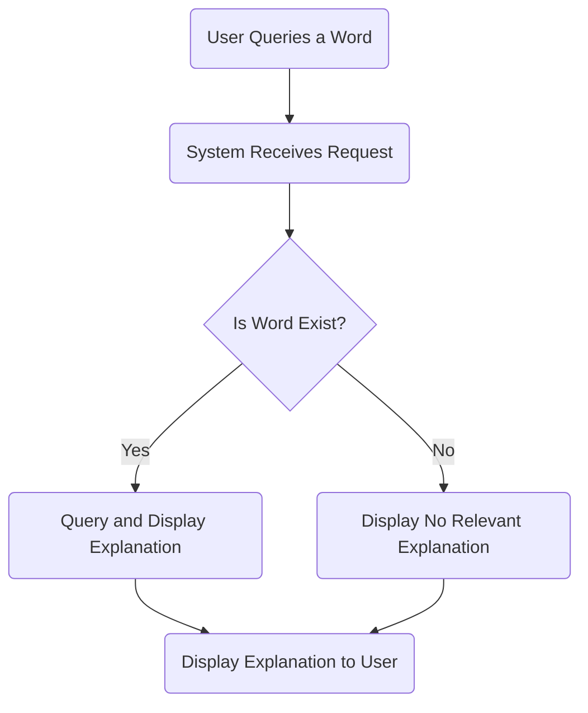
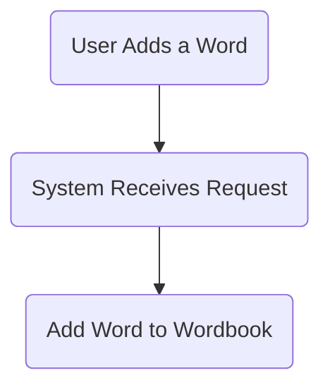
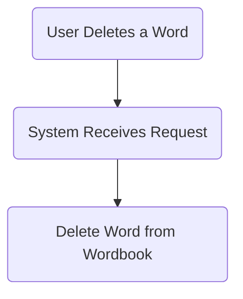
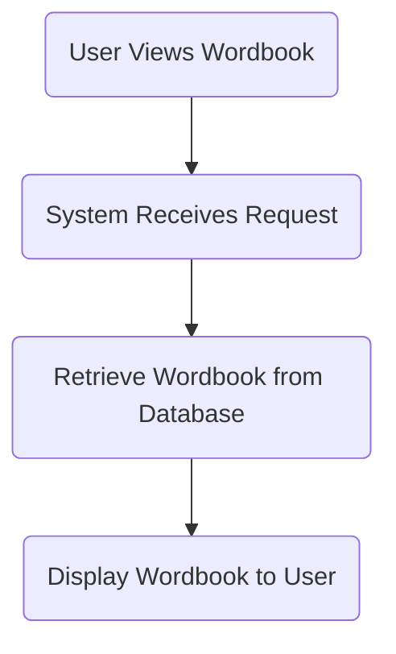

# Domain-Driven Design

## Event: User Queries a Word

```mermaid
graph TD;
    A(User Queries a Word) --> B(System Receives Request)
    B --> C{Is Word Exist?}
    C -->|Yes| D(Query and Display Explanation)
    C -->|No| E(Display No Relevant Explanation)
    D --> F(Display Explanation to User)
    E --> F
```

## Event: User Adds a Word

```mermaid
graph TD;
    A(User Adds a Word) --> B(System Receives Request)
    B --> C(Add Word to Wordbook)
```

## Event: User Deletes a Word

```mermaid
graph TD;
    A(User Deletes a Word) --> B(System Receives Request)
    B --> C(Delete Word from Wordbook)
```

## Event: User Views Wordbook

```mermaid
graph TD;
    A(User Views Wordbook) --> B(System Receives Request)
    B --> C(Retrieve Wordbook from Database)
    C --> D(Display Wordbook to User)
```